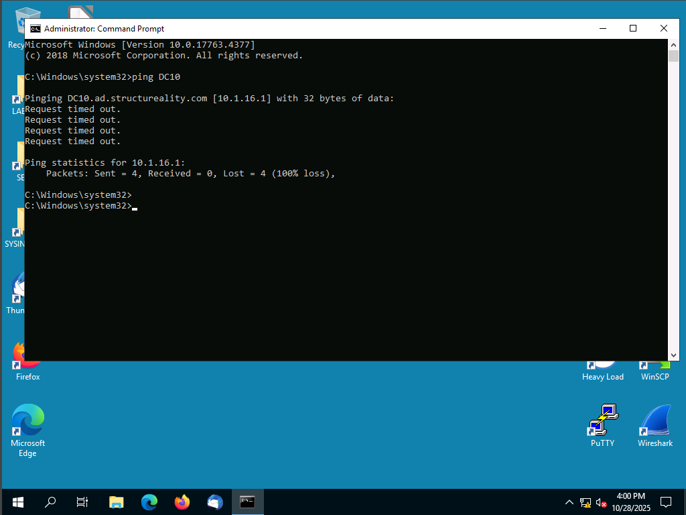
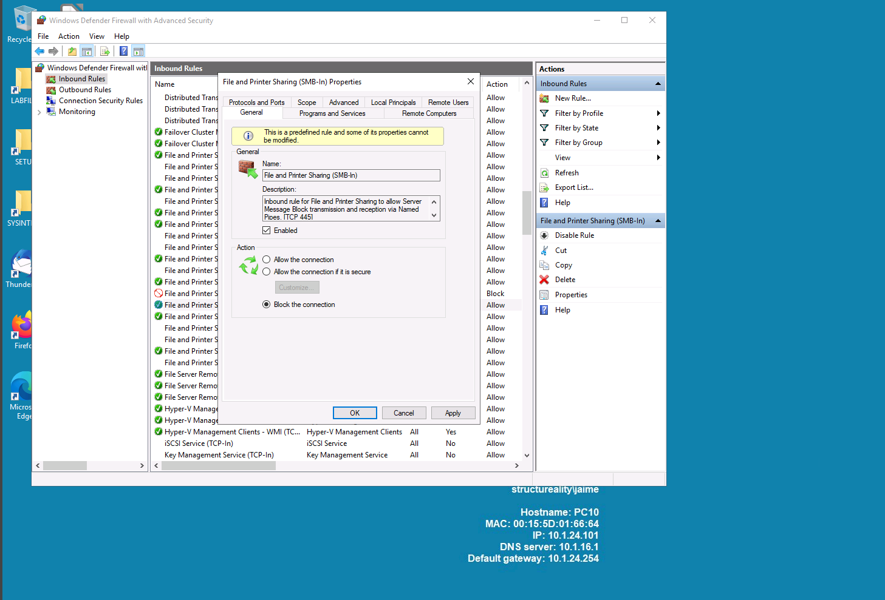

# CompTIA Security+ Lab: Configuring Firewall Rules

## Scenario Overview
As a member of the Structureality Inc. security team, you are responsible for improving your organization's internal security posture. In this lab, you’ll manage Windows Firewall rules to control communication between internal systems.

You’ll first test baseline connectivity (ICMP ping) between systems, then implement firewall rules to block ping responses and later restrict access to file shares.

---

## Lab Environment
- **PC10**: Windows Server 2019 (client)
- **DC10**: Windows Server 2019 (domain controller / file server)

### Tools Used
- Windows Defender Firewall with Advanced Security  
- Command Prompt (ping, net use)  
- CompTIA Labs virtual environment  

---

## Objectives
This lab aligns with the following **CompTIA Security+ (SY0-701)** objectives:

- **2.5:** Explain the purpose of mitigation techniques used to secure the enterprise.  
- **4.5:** Given a scenario, modify enterprise capabilities to enhance security.  

---

## Steps Overview

### 1. Verify Initial Connectivity
- From **PC10**, test ICMP (ping) to **DC10**.  
- Confirm successful communication before rule changes.

**📸 Screenshot 1:** Successful ping from PC10 to DC10 (before firewall rule)  


---

### 2. Create Firewall Rule to Block ICMP
- Open **Windows Defender Firewall with Advanced Security**.  
- Add an **Inbound Rule** to **block ICMPv4 Echo Requests** on DC10.  
- Retest connectivity from PC10.

**📸 Screenshot 2:** Firewall rule properties (ICMP block rule)  


**📸 Screenshot 3:** Ping test showing request timed out (after rule applied)  


---

### 3. Test File Share Access
- From **PC10**, connect to a shared folder on **DC10** using:
  ```bash
  net use \\DC10\Share
  ```
- Confirm successful access.

**📸 Screenshot 4:** File share opened successfully (before blocking rule)  


---

### 4. Block File Share Access
- On **DC10**, create a new **Inbound Rule** to **block SMB traffic (TCP ports 445, 139)**.  
- Retest access from **PC10**.

**📸 Screenshot 5:** Firewall rule properties (SMB block rule)  


**📸 Screenshot 6:** Access denied / network path not found message (after blocking rule)  


---

### 5. Summarize Results

| Test | Before | After |
|------|---------|--------|
| **ICMP (Ping)** | Successful | Blocked |
| **File Share Access** | Successful | Blocked |

**📸 Screenshot 7:** Windows Firewall inbound rules list (final configuration)  


---

## Analysis & Key Takeaways
- **Mitigation techniques** such as restricting ICMP and SMB help reduce attack surfaces.  
- **Firewall rules** can enforce least privilege communication policies within an enterprise network.  
- Blocking unnecessary services (like SMB or ICMP) reduces lateral movement risk.

---

## Repository Structure

```
CompTIA-SecurityPlus-Firewall-Lab/
│
├── README.md
└── images/
    ├── 1.png
    ├── 2.png
    ├── 3.png
    ├── 4.png
    ├── 5.png
    ├── 6.png
    └── 7.png
```
